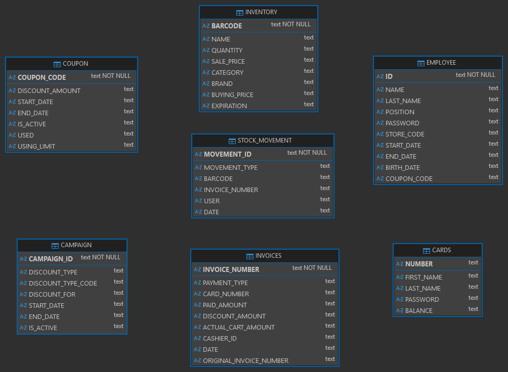

# 🗄️ MARSYS – Cloud-Based DBMS Project

MARSYS is a **Database Management System (DBMS) university project** developed using **Java and JavaFX (FXML)** with a **cloud-based PostgreSQL database hosted on NeonDB**.

The project demonstrates real-world DBMS practices by combining **secure cloud database access**, **environment variable–based configuration**, and **high-performance connection pooling**.

---

## 🎓 Project Context

- **Type:** University DBMS Course Project  
- **Database:** Cloud-based PostgreSQL (NeonDB)  
- **Interface:** JavaFX GUI (FXML)  
- **Configuration:** Environment variables  
- **Performance:** HikariCP connection pool  

This project focuses on **database design, cloud-based DB access, security, and performance optimization**, rather than only user interface development.

---

## ✨ Features

- JavaFX-based graphical user interface using FXML
- Secure connection to a private cloud PostgreSQL database
- Environment variable–based database configuration
- Full CRUD operations (Create, Read, Update, Delete)
- High-performance database access using **HikariCP**
- Clean, modular, and layered architecture

---

## 🛠️ Technologies Used

| Technology | Description |
|----------|------------|
| Java | Core programming language |
| JavaFX | GUI framework |
| FXML | UI layout design |
| PostgreSQL | Relational database |
| NeonDB | Cloud-based PostgreSQL hosting |
| JDBC | Database connectivity |
| HikariCP | High-performance connection pooling |
| Maven | Dependency and build management |

---

## ☁️ Cloud Database & Security

The PostgreSQL database is hosted on **NeonDB** and is **not publicly accessible**.

For security reasons:
- Database credentials are **not hardcoded**
- Sensitive information is excluded from the repository
- Database access is handled via **environment variables**

Because of this setup, cloning the repository alone is **not sufficient to run the application** without proper credentials.

---

## ⚙️ Environment Configuration

The application expects the following environment variables at runtime:

- `DB_URL`
- `DB_USERNAME`
- `DB_PASSWORD`

These variables are used to establish a secure JDBC connection to the NeonDB PostgreSQL instance.

> This configuration approach reflects real-world secure database practices.

---

## 🚀 Database Connection Pooling (HikariCP)

The project uses **HikariCP** to manage database connections efficiently.

Benefits of HikariCP:
- Faster connection initialization
- Reduced overhead compared to traditional connection handling
- Better scalability
- Improved overall application performance

Using a connection pool makes the project closer to **production-grade DBMS architectures**.

---

## 🧠 Database Design

The schema includes normalized tables, primary and foreign key constraints,
and enforces referential integrity to ensure data consistency.

The database schema was designed using relational database principles.
The Entity–Relationship Diagram (ERD) below was **generated directly from the PostgreSQL database using DBeaver**.



---

## 🖥️ User Interface

The user interface is built using **JavaFX with FXML**, providing a clear separation between:

- UI layout (FXML)
- Application logic (Java controllers)
- Database access layer

This separation improves maintainability, readability, and scalability.

---

## 📂 Project Structure
```
MARSYS/
├── src/
│ ├── main/
│ │ ├── java/
│ │ └── resources/
│ │ ├── fxml/
│ │ └── styles/
├── diagrams/
├── pom.xml
├── README.md
```
## 📈 Learning Outcomes

Through this project, the following concepts were practiced:

- Cloud-based PostgreSQL usage (NeonDB)
- Secure database configuration using environment variables
- Java–PostgreSQL integration with JDBC
- Connection pooling using HikariCP
- GUI-based DBMS development with JavaFX & FXML
- Modular and layered system architecture

---

## 📄 License

This project was developed for **educational purposes** as part of a university DBMS course.  
The code is shared for learning and reference.

---
